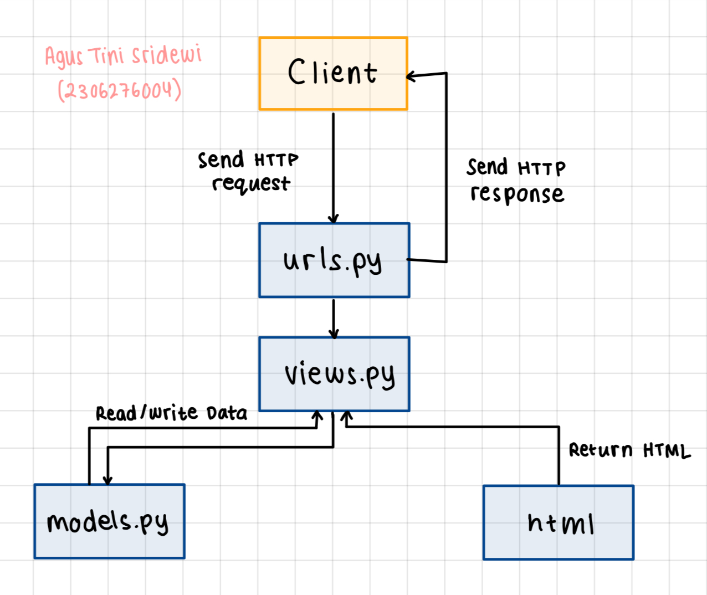

link aplikasi pws: http://agus-tini31-thriftclick.pbp.cs.ui.ac.id/

<details>
<summary>TUGAS MANDIRI 2</summary>

# TUGAS MANDIRI 2 
### Jelaskan bagaimana cara kamu mengimplementasikan checklist di atas secara step-by-step (bukan hanya sekadar mengikuti tutorial) 
1) Membuat sebuah proyek Django baru
    - Membuat direktori lokal baru dengan nama thrift-click lalu menjalankan virtual environment di dalamnya.
    - Membuat berkas requirements.txt berisikan dependencies dan menginstallnya. Setelah itu, menjalankan perintah 'django-admin startproject thrift-click .' yang akan membuat folder thrift-click berisi konfigurasi dasar untuk projek Django.
    - Menambahkan localhost ke dalam ALLOWED_HOSTS lalu menjalankan server Django pada direktori lokal.
    - Membuat repositori GitHub thrift-click. Setelah itu, menginisiasi direktori lokal thrift-click sebagai repositori Git.
    - Menambahkan file .gitignore ke dalam repositori lokal lalu mempush semua perubahan pada repositori lokal ke repositori github.
2) Membuat aplikasi dengan nama main pada proyek tersebut
    - Membuat aplikasi baru dengan nama main dalam direktori proyek thrift-click dengan menjalankan perintah 'python manage.py startapp main' yang akan membuat membuat folder main yang berisi berkas-berkas dasar untuk aplikasi Django seperti views.py, models.py, dan urls.py.
    - Membuka settings.py di folder proyek, lalu tambahkan 'main' ke dalam daftar INSTALLED_APP agar Django mengenali aplikasi baru.
3) Melakukan routing pada proyek agar dapat menjalankan aplikasi main
    - Melakukan routing pada proyek agar dapat menjalankan aplikasi main.
    - ⁠Mengimpor fungsi include dari django.urls.
    - ⁠Menambahkan rute URL path('', include('main.urls')) untuk mengarahkan ke tampilan main di dalam variabel urlpatterns.
4) Membuat model pada aplikasi main dengan nama Product dan memiliki atribut wajib sebagai berikut. name, price, description
    - Mengisi berkas model.py dalam aplikasi main dengan model dengan atribut atau field yang memiliki tipe data masing-masing. Untuk name, tipe datanya adalah CharField, untuk price, tipe datanya, IntegerField. Untuk description, tipe datanya TextField.
5) Membuat sebuah fungsi pada views.py untuk dikembalikan ke dalam sebuah template HTML yang menampilkan nama aplikasi serta nama dan kelas kamu.
    - Membuka berkas views.py yang terletak di dalam berkas aplikasi main.
    - ⁠Mengimport render dari django.shortcuts. Menambahkan fungsi show_main yang berisi context.
    - ⁠Memasukan return render(request, "main.html", context) yang berguna untuk me-render tampilan main.html dengan menggunakan fungsi render
    - ⁠Membuka berkas main.html dan mengubah nama dan kelas menjadi struktur kode Django yang sesuai untuk menampilkan data (template variables)
6) Membuat sebuah routing pada urls.py aplikasi main untuk memetakan fungsi yang telah dibuat pada views.py.
    - ⁠Untuk membuat routing pada urls.py di aplikasi Django, perlu memetakan URL ke fungsi di views.py menggunakan fungsi path(). Misalnya, path('',views.home, name='home') memetakan URL root ke fungsi home di views.py, sehingga saat URL tersebut diakses, fungsi yang sesuai akan dijalankan.
7) Melakukan deployment ke PWS terhadap aplikasi yang sudah dibuat
    - Membuat new project di PWS kemudian menambahkan URL deployment "agus-tini31-thriftclick.pbp.cs.ui.ac.id" pada ALLOWED_HOST dalam settings.py sesuai username dan nama proyek di repositori lokal.
    - Menjalankan Project Command pada halaman PWS lalu mengubah nama branch menjadi main.
    - Mempush perubahan pada repositori lokal ke PWS dengan menjalankan perintah 'git push pws main:master'.
8) Membuat sebuah README.md yang berisi tautan menuju aplikasi PWS yang sudah di-deploy, serta jawaban dari beberapa pertanyaan berikut.
    - Buatlah file baru dengan nama README.md di direktori utama proyek.
    - ⁠Mengedit file README.md untuk keterangan dan sesuai kebutuhan

step akhir:
- mempush semua perubahan pada repositori lokal ke repository github dan PWS
- men-deactivate virtual environment

### Buatlah bagan yang berisi request client ke web aplikasi berbasis Django beserta responnya dan jelaskan pada bagan tersebut kaitan antara urls.py, views.py, models.py, dan berkas html 

Request client pertama kali diproses oleh urls.py, yang mencocokkan URL dengan fungsi view di views.py. Di dalam views.py, logika dijalankan dan jika data dari database diperlukan, fungsi view memanggil model di models.py. Setelah data diperoleh, view menyiapkan template HTML dengan data tersebut, lalu merendernya. Hasilnya berupa halaman web atau respon JSON yang dikirim kembali ke browser client.

### Jelaskan fungsi git dalam pengembangan perangkat lunak!
Git adalah sistem kontrol versi yang membantu developer melacak perubahan kode sumber, berkolaborasi, dan mengelola versi proyek selama pengembangan perangkat lunak. Beberapa fungsi git diantaranya:
1) menyimpan versi berbeda dari sebuah proyek sebagai "commit" yang dapat mengurangi resiko kehilangan pekerjaan.
2) memungkinkan developer bekerja pada proyek yang sama secara bersamaan di mesin lokal mereka tanpa saling mengganggu pekerjaan masing-masing.
3) branching yang memungkinkan pengembang untuk membuat cabang (branch) terpisah dari proyek utama dan merging untuk (merge) menggabungkan kembali cabang tersebut ke cabang utama tanpa konflik.
4) menyediakan catatan lengkap dari siapa yang mengubah apa, kapan, dan mengapa, melalui fitur commit dan log.
5) mendeteksi konflik ketika dua pengembang melakukan perubahan pada bagian kode yang sama dan meminta pengembang untuk menyelesaikannya

### Menurut Anda, dari semua framework yang ada, mengapa framework Django dijadikan permulaan pembelajaran pengembangan perangkat lunak?
1) Django menyediakan hampir semua komponen yang diperlukan untuk membangun aplikasi web langsung dari frameworknya termasuk sistem autentikasi, ORM (Object-Relational Mapping), manajemen URL, dan formulir.
2) MVT (Model-View-Template) yang memisahkan logika bisnis, tampilan, dan kontrol, memudahkan pemula memahami alur aplikasi.
3) ORM (Object-Relational Mapping) Django memungkinkan interaksi dengan database tanpa perlu menulis SQL manual.
4) Django melindungi dari berbagai ancaman keamanan seperti CSRF (Cross-Site Request Forgery), XSS (Cross-Site Scripting), SQL Injection, dan clickjacking secara otomatis.
5) Django mendukung pengembangan aplikasi dengan cepat melalui fitur-fitur siap pakai.
6) Skalabilitas, banyak aplikasi berskala besar seperti Instagram dan Pinterest menggunakan Django, memberikan relevansi dalam dunia nyata.
7) Django adalah framework full-stack, yang berarti pengembang dapat mempelajari baik bagian front-end maupun bagian back-end.
8) Deployment yang praktis, manajemen migrasi basis data dan pengaturan konfigurasi Django mendukung proses deployment mempermudah proses deployment ke server produksi.

### Mengapa model pada Django disebut sebagai ORM?
Model pada Django disebut sebagai ORM (Object-Relational Mapping) karena Django menggunakan pendekatan ORM untuk menghubungkan objek-objek Python (seperti model) dengan tabel-tabel dalam basis data relasional. ORM memungkinkan developer untuk berinteraksi dengan basis data tanpa harus menulis query SQL secara langsung. Contoh sederhana model dalam Django:
from django.db import models
```python
class Product(models.Model):
    name = models.CharField(max_length=100)
    price = models.DecimalField(max_digits=10, decimal_places=2)
    description = models.TextField() 
```
</details>

<details>
<summary>TUGAS MANDIRI 3</summary>

# TUGAS MANDIRI 3 
### Jelaskan mengapa kita memerlukan data delivery dalam pengimplementasian sebuah platform? 
Data delivery mengoptimalkan performa platform dengan mengurangi waktu muat dan bandwidth, memungkinkan pengolahan data real-time, serta mendukung keamanan dan kontrol akses data melalui enkripsi dan autentikasi. Selain itu, data delivery juga memungkinkan platform untuk menangani pertumbuhan pengguna dan volume data.

### Menurutmu, mana yang lebih baik antara XML dan JSON? Mengapa JSON lebih populer dibandingkan XML?
Melalui pengamatan akan kedua hasil akses URL tersebut pada postman, menurut saya JSON lebih baik ketimbang XML karena komponen yang terdapat di dalamnya lebih mudah dibaca.
Setelah mencari tahu lebih lanjut, ternyata JSON memang lebih disukai dibandingkan XML, dengan beberapa alasan berikut.
 - Sintaks JSON mirip dengan bahasa pemrograman modern dan formatnya hanya terdiri dari objek dan array sehingga lebih mudah dibaca. Sedangkan, sintaks XML lebih kompleks dengan tag pembuka dan penutup, atribut, dan hierarki yang lebih rumit. 
 - Selain itu, format JSON merupakan subset dari objek JavaScript yang memudahkan pengolahan data JSON langsung dari browser. Jika menggunakam XML, dibutuhkan parsing tambahan (pembacaan dan interpretasi data)
 - Parsing dan serialisasi JSON lebih cepat dan lebih efisien karena banyak bahasa pemrograman memiliki dukungan built-in atau library yang efisien untuk menangani JSON. 

### Jelaskan fungsi dari method is_valid() pada form Django dan mengapa kita membutuhkan method tersebut?
Fungsi utama dari is_valid() adalah untuk memeriksa apakah data yang diterima dari pengguna (misalnya, melalui form HTML) sesuai dengan aturan dan batasan yang telah ditetapkan dalam definisi form tersebut.


### Mengapa kita membutuhkan csrf_token saat membuat form di Django? Apa yang dapat terjadi jika kita tidak menambahkan csrf_token pada form Django? Bagaimana hal tersebut dapat dimanfaatkan oleh penyerang? 
Kita butuh menambahkan csrf_token (Cross-Site Request Forgery token) agar aplikasi web terlindungi dari serangan (Cross-Site Request Forgery) CSRF. CSRF adalah jenis serangan di mana penyerang memanipulasi akses pengguna yang sudah login (terautentikasi) untuk melakukan tindakan yang tidak diinginkan pada aplikasi web yang mereka akses. 

csrf_token adalah token unik yang dihasilkan oleh server dan disertakan dalam setiap form HTML. Token ini harus dikirimkan kembali ke server dengan setiap permintaan POST atau tindakan yang memodifikasi data. Server memeriksa token ini untuk memastikan bahwa permintaan tersebut benar-benar berasal dari pengguna yang sah dan bukan dari penyerang.

Jika csrf_token tidak ditambahkan, penyerang dapat memanipulasi data atau membuat perubahan yang tidak sah pada aplikasi. Penyerang dapat memanfaatkan kerentanan CSRF untuk membuat permintaan berbahaya kepada aplikasi web dengan menggunakan formulir atau skrip yang disembunyikan di situs web lain. Jika pengguna yang sah sedang login, penyerang dapat membuat permintaan palsu yang memanfaatkan kredensial yang sudah ada. 

### Jelaskan bagaimana cara kamu mengimplementasikan checklist di atas secara step-by-step (bukan hanya sekadar mengikuti tutorial) 
1) Membuat input form untuk menambahkan objek model pada app sebelumnya.
    - Membuat form (forms.py) dengan model ProductEntry dengan field untuk menerima data Product baru
    - Menambahkan fungsi create_product_entry(views.py) yang mengarahkan pengguna dari halaman utama ke halaman input kemudian memvalidasi, memproses, dan menyimpan input. Setelah input berhasil disimpan, pendapat akan diarahkan kembali ke halaman utama (redirect). 
    - Menambahkan product_entries = Product.objects.all() pada fungsi show_main (views.py) agar input yang berhasil diterima ditampilkan ketika pengguna diarahkan kembali ke halaman utama
    - Membuat HTML baru (create_mood_entry.html) untuk menampilkan form input
    - URL Routing form input dengan menambahkan path URL ke dalam urlpatterns (urls.py)

2) Tambahkan 4 fungsi views baru untuk melihat objek yang sudah ditambahkan dalam format XML, JSON, XML by ID, dan JSON by ID.
    - Mengimport HttpResponse dan Serializer pada views.py 
    - Menambahkan 4 fungsi untuk view dengan format JSON dan XML di views.py (show_xml, show_json, show_xml_by_id, dan show_json_by_id)

3) Membuat routing URL untuk masing-masing views yang telah ditambahkan pada poin 2
    - Meng-import keempat fungsi view yang sudah dibuat pada poin 2 ke dalam urls.py.
    - Menambahkan path URL masing-masing view ke dalam urlpatterns (urls.py)

### XML

### JSON

### XML by ID

### JSON by ID

</details>

<details>
<summary>TUGAS MANDIRI 4</summary>

# TUGAS MANDIRI 4
### Apa perbedaan antara HttpResponseRedirect() dan redirect()
1. **HttpResponseRedirect()**  
   `HttpResponseRedirect()` adalah kelas yang digunakan untuk mengembalikan respons HTTP yang memberitahu browser untuk mengalihkan ke URL yang ditentukan. Kelas ini diimpor dari `django.http`.

2. **redirect()**  
   `redirect()` adalah fungsi shortcut yang memungkinkan pengalihan menggunakan URL, nama view, atau model instance, dan otomatis mengonversi nama view menjadi URL. Fungsi ini dapat diimpor dari `django.shortcuts`.


### Jelaskan cara kerja penghubungan model Product dengan User!
Dalam project ini, model Product dihubungkan dengan model User menggunakan ForeignKey.
```python
class Product(models.Model):
    user = models.ForeignKey(User, on_delete=models.CASCADE)
    id = models.UUIDField(primary_key=True, default=uuid.uuid4, editable=False)
    name = models.CharField(max_length=255)
    description = models.TextField()
    price = models.IntegerField()
```
`models.ForeignKey(User, on_delete=models.CASCADE)`: Menunjukkan bahwa kolom ini adalah kunci asing yang merujuk ke model User.
`on_delete=models.CASCADE`: Jika pengguna dihapus, semua produk yang terkait dengan pengguna tersebut juga akan dihapus dari database.
#### Cara Kerja?
- Setiap kali seorang pengguna yang sedang logged in menambahkan entry, entry tersebut akan terhubung dengan si pengguna. 
- Penggunaan ForeignKey memungkinkan terbentuknya relasi many-to-one antara model Product dan User. Artinya, satu User dapat memiliki banyak Product, sementara setiap Product hanya dapat dimiliki oleh satu User saja

### Apa perbedaan antara authentication dan authorization, apakah yang dilakukan saat pengguna login? Jelaskan bagaimana Django mengimplementasikan kedua konsep tersebut.
1) **Authentication**  
Proses untuk memverifikasi identitas pengguna. Ini memastikan bahwa pengguna yang mencoba mengakses sistem adalah siapa yang mereka klaim. 
2) **Authorization**  
Proses untuk menentukan apakah pengguna yang telah terautentikasi memiliki izin untuk melakukan tindakan tertentu atau mengakses sumber daya tertentu. 

Alur Kerja Login Pengguna:
1. Saat pengguna memasukkan username dan password untuk login, sistem akan memeriksa apakah kombinasi tersebut sesuai dengan yang tersimpan di database.
2. Setelah berhasil login, sistem akan memeriksa apakah pengguna tersebut memiliki hak akses untuk request yang diminta.

Implementasi Authentication & Authorization
- Django menggunakan middleware untuk mengelola autentikasi dan otorisasi.
- Pengguna dapat mengautentikasi menggunakan metode seperti `authenticate()` untuk memverifikasi kredensial dan `login()` untuk memulai sesi pengguna yang terautentikasi.
- Django menyediakan decorator seperti `@login_required` untuk melindungi tampilan agar hanya dapat diakses oleh pengguna yang telah terautentikasi. 
- Django memiliki fitur permissions untuk authorization.
- Setelah pengguna terautentikasi, informasi tentang pengguna yang terautentikasi disimpan dalam `request.user`


### Bagaimana Django mengingat pengguna yang telah login? Jelaskan kegunaan lain dari cookies dan apakah semua cookies aman digunakan?
Django menggunakan session ID dan cookies. Ketika pengguna berhasil melakukan login, Django membuat session yang unik untuk pengguna tersebut. Sesi ini menyimpan informasi tentang pengguna, seperti ID pengguna, dalam basis data atau sistem penyimpanan lainnya.
Setiap kali pengguna melakukan permintaan selanjutnya, Django memeriksa sesi yang terkait dengan pengguna untuk mengonfirmasi apakah pengguna tersebut terautentikasi. Django juga menggunakan cookies untuk mengelola sesi. Setelah pengguna login, Django mengirimkan cookie ke browser pengguna yang berisi ID sesi. Cookie ini biasanya bernama sessionid. Browser pengguna akan menyimpan cookie ini dan mengirimkannya kembali ke server dengan setiap permintaan, memungkinkan Django untuk mengenali pengguna yang telah login.

### Jelaskan bagaimana cara kamu mengimplementasikan checklist di atas secara step-by-step (bukan hanya sekadar mengikuti tutorial).
1) Mengimplementasikan fungsi registrasi, login, dan logout untuk memungkinkan pengguna untuk mengakses aplikasi sebelumnya dengan lancar.
    #### Registrasi
    - Membuat form registrasi view menggunakan `UserCreationForm`.
    ```python
    def register(request):
        form = UserCreationForm()

        if request.method == "POST":
            form = UserCreationForm(request.POST)
            if form.is_valid():
                form.save()
                messages.success(request, 'Your account has been successfully created!')
                return redirect('main:login')
        context = {'form':form}
        return render(request, 'register.html', context)
    ```
    - Membuat berkas `register.html` dalam templates untuk tampilan form registrasi.

    #### Login
    - Membuat form login view untuk pengguna yang sudah terdaftar.
    ```python
    def login_user(request):
        if request.method == 'POST':
            form = AuthenticationForm(data=request.POST)

            if form.is_valid():
                    user = form.get_user()
                    login(request, user)
                    response = HttpResponseRedirect(reverse("main:show_main"))
                    response.set_cookie('last_login', str(datetime.datetime.now()))
                    return response

        else:
            form = AuthenticationForm(request)
        context = {'form': form}
        return render(request, 'login.html', context)
    ```
    - Membuat berkas `login.html` dalam templates untuk tampilan form login.

    #### Logout
    - Membuat form logout view
    ```python
    def logout_user(request):
        logout(request)
        response = HttpResponseRedirect(reverse('main:login'))
        response.delete_cookie('last_login')
        return response
    ```
    - Menambahkan logout button pada `main.html` yang terintegrasi dengan hyperlink logout
    ```python
    <a href="">
        <button>Logout</button>
    </a>
    ```
    Mengimport dan menambahkan path URL masing-masing view yang baru saja dibuat ke dalam urlpatterns (urls.py)
    ```python
    from django.urls import path
    from main.views import register, login_user, logout_user

    urlpatterns = [
        path('', show_main, name='show_main'),
        path('create-product-entry', create_product_entry, name='create_product_entry'),
        path('xml/', show_xml, name='show_xml'),
        path('json/', show_json, name='show_json'),
        path('xml/<str:id>/', show_xml_by_id, name='show_xml_by_id'),
        path('json/<str:id>/', show_json_by_id, name='show_json_by_id'),
        path('register/', register, name='register'),
        path('login/', login_user, name='login'),
        path('logout/', logout_user, name='logout'),
    ]
    ```

2) Membuat dua akun pengguna dengan masing-masing tiga dummy data menggunakan model yang telah dibuat pada aplikasi sebelumnya untuk setiap akun di lokal.  
Melakukan registrasi 2 akun pada page signup/ kemudian login dan menambahkan 3 data pada page create-product-entry/ untuk kedua akun.


3) Menghubungkan model Product dengan User
    - Membuat model Product dan tambahkan ForeignKey ke User, sehingga setiap produk yang dibuat dapat dikaitkan dengan pengguna.
    ```python
    import uuid  
    from django.db import models
    from django.contrib.auth.models import User

    class Product(models.Model):
        user = models.ForeignKey(User, on_delete=models.CASCADE)
        id = models.UUIDField(primary_key=True, default=uuid.uuid4, editable=False)
        name = models.CharField(max_length=255)
        description = models.TextField()
        price = models.IntegerField()
    ```
    - makemigrations dan migrate agar database sesuai dengan perubahan terbaru pada models.py

4) Menampilkan detail informasi pengguna yang sedang logged in seperti username dan menerapkan cookies seperti last login pada halaman utama aplikasi.
    - Menyimpan Data Last Login dan Username saat Login, serta set cookies saat user login
    ```python
    def login_user(request):
    ...
    if form.is_valid():
        user = form.get_user()
        login(request, user)
        response = HttpResponseRedirect(reverse("main:show_main"))
        response.set_cookie('last_login', str(datetime.datetime.now()))
        return response
    ...
    ```
    - Mengirim Data Last Login ke Halaman Utama
    ```python
    ...
        context = {
            'items': items,
            'name': request.user.username,       
            'npm': '2306276004',
            'kelas': 'PBP C',
            'product_entries': Product.objects.filter(user=request.user),
            'last_login': request.COOKIES['last_login'],
        }
    ...
    ```
    - Di template main.html tampilkan waktu login terakhir:
    ```python
    ...
    <h5>Sesi terakhir login: {{ last_login }}</h5>
    ...
    ```
</details>
